# Claude Task Manager UI - Personal Workflow Diagrams

## Overview

This document shows how individual developers can use the Claude Task Manager UI to ship features and products from idea to production. The UI wraps the powerful Task Master CLI with a beautiful interface that provides visual project management, smart semantic layers, and persistent context preservation.

## 0. System Architecture: UI Layer Over Task Master


## 1. Personal Feature Shipping Workflow with UI

```mermaid
graph TB
    subgraph "🎯 Idea to Feature (UI Experience)"
        A1[💡 Feature Idea]
        A2[📝 Create PRD in UI]
        A3[🔍 AI Research & Planning]
        A4[🤖 Generate Tasks Visually]
        A5[⚡ Implement with Context]
        A6[🚀 Ship to Production]

        A1 --> A2
        A2 --> A3
        A3 --> A4
        A4 --> A5
        A5 --> A6
    end

    subgraph "🖥️ Claude Task Manager UI"
        UI1[PRD Editor with AI assistance]
        UI2[Visual task generation from PRD]
        UI3[Smart task dashboard]
        UI4[Progress tracking & handoffs]
    end

    subgraph "⚙️ Task Master Engine (Behind UI)"
        CMD1[task-master parse-prd prd.txt]
        CMD2[task-master expand --all --research]
        CMD3[task-master next]
        CMD4[task-master set-status --status=done]
    end

    A2 --> UI1
    UI1 --> CMD1
    A3 --> UI2
    UI2 --> CMD2
    A4 --> UI3
    UI3 --> CMD3
    A5 --> UI4
    UI4 --> CMD4

    style A6 fill:#50C878,stroke:#333,stroke-width:3px
    style UI3 fill:#FFB347
```



## 2. Daily Development Loop with UI


## 3. Building Claude Task Manager UI - Our Product Journey

```mermaid
graph TB
    subgraph "Week 1: UI Foundation"
        W1A[Idea: Beautiful Task Master UI]
        W1B[Research existing tools & patterns]
        W1C[Create PRD for Task Manager UI]
        W1D[Generate UI development tasks]
        W1E[Setup Next.js + Tailwind architecture]

        W1A --> W1B
        W1B --> W1C
        W1C --> W1D
        W1D --> W1E
    end

    subgraph "Week 2-6: Core UI Features"
        W2A[Task Master CLI integration]
        W2B[Visual task dashboard]
        W2C[PRD editor with AI assistance]
        W2D[Real-time task sync engine]
        W2E[Context preservation UI]

        W2A --> W2B
        W2B --> W2C
        W2C --> W2D
        W2D --> W2E
    end

    subgraph "Week 7-10: Advanced UI"
        W3A[Visual task expansion interface]
        W3B[AI handoff visualizations]
        W3C[Smart notifications system]
        W3D[Progress analytics dashboard]
        W3E[Mobile responsive design]

        W3A --> W3B
        W3B --> W3C
        W3C --> W3D
        W3D --> W3E
    end

    subgraph "Week 11-12: UI Launch"
        W4A[Performance optimization]
        W4B[Security audit & testing]
        W4C[Documentation & guides]
        W4D[Deployment & CI/CD]
        W4E[🚀 Claude Task Manager UI Launch]

        W4A --> W4B
        W4B --> W4C
        W4C --> W4D
        W4D --> W4E
    end

    W1E ==> W2A
    W2E ==> W3A
    W3E ==> W4A

    style W4E fill:#50C878,stroke:#333,stroke-width:3px
    style W1C fill:#FFB347
    style W2B fill:#B4E5FF
```



## 4. Task Expansion & Implementation Flow


## 5. AI Agent Workflow for Personal Development

```mermaid
flowchart LR
    subgraph "You Want a Feature"
        START[💡 "I need user authentication"]
    end

    subgraph "Research Agent"
        R1[🔍 Research OAuth providers]
        R2[📊 Compare security options]
        R3[📝 Document recommendations]
    end

    subgraph "Planning Agent"
        P1[📋 Create task breakdown]
        P2[🔗 Map dependencies]
        P3[⏰ Estimate complexity]
    end

    subgraph "Code Agent (Claude)"
        C1[🔨 Implement auth middleware]
        C2[🎨 Build login UI]
        C3[🧪 Write tests]
        C4[🔍 Code review]
    end

    subgraph "Shipped Feature"
        END[✅ Authentication working]
    end

    START --> R1
    R1 --> R2
    R2 --> R3
    R3 --> P1
    P1 --> P2
    P2 --> P3
    P3 --> C1
    C1 --> C2
    C2 --> C3
    C3 --> C4
    C4 --> END

    style START fill:#FFE5B4
    style END fill:#50C878
```

## 6. Context Preservation & Knowledge Building

```mermaid
graph TB
    subgraph "Project Context Grows Over Time"
        T1[Day 1: Basic project setup]
        T2[Day 5: User auth decisions]
        T3[Day 10: Database schema choices]
        T4[Day 15: API design patterns]
        T5[Day 20: UI component library]
        T6[Day 25: Performance optimizations]
    end

    subgraph "Claude Code Always Knows"
        K1[🧠 Why you chose PostgreSQL]
        K2[🔐 Your auth implementation]
        K3[🎨 Your design system]
        K4[📊 Your data models]
        K5[⚡ Performance requirements]
        K6[🔧 Your tooling preferences]
    end

    T1 --> K1
    T2 --> K2
    T3 --> K4
    T4 --> K2
    T5 --> K3
    T6 --> K5

    K1 --> |Informs| Future1[New feature development]
    K2 --> |Guides| Future2[Security decisions]
    K3 --> |Ensures| Future3[Design consistency]
    K4 --> |Maintains| Future4[Data integrity]

    style Future1 fill:#B4E5FF
    style Future2 fill:#FFB4E5
    style Future3 fill:#B4FFB4
    style Future4 fill:#FFE5B4
```



## 7. Real Example: Adding AI Handoff Visualization to Our UI


## 8. The Power of Persistent Context

```mermaid
graph LR
    subgraph "Without Task Manager"
        OLD1[💭 Remember project details]
        OLD2[🔍 Search through old code]
        OLD3[📝 Re-explain context to AI]
        OLD4[🔄 Inconsistent implementations]
        OLD5[😵 Context switching overhead]

        OLD1 --> OLD2
        OLD2 --> OLD3
        OLD3 --> OLD4
        OLD4 --> OLD5
    end

    subgraph "With Task Manager"
        NEW1[🧠 AI remembers everything]
        NEW2[⚡ Instant context loading]
        NEW3[🎯 Consistent code patterns]
        NEW4[📈 Builds on previous work]
        NEW5[🚀 Focus on building features]

        NEW1 --> NEW2
        NEW2 --> NEW3
        NEW3 --> NEW4
        NEW4 --> NEW5
    end

    style OLD5 fill:#FFB4B4
    style NEW5 fill:#50C878
```



## Summary

The Claude Task Manager UI wraps the powerful Task Master CLI with a beautiful, intuitive interface that enables individual developers to:

1. **Ship Features Faster**: Visual task management from idea to implementation
2. **Maintain Context**: Persistent context preservation through beautiful UI
3. **Focus on Creating**: Less CLI complexity, more visual workflow
4. **Build Consistently**: UI enforces patterns and provides visual feedback
5. **Scale Complexity**: Handle larger projects with visual organization

**How We're Building This:**

- **UI Layer**: React/Next.js interface wrapping Task Master functionality
- **Sync Engine**: Real-time synchronization between UI and Task Master CLI
- **Visual Workflows**: Transform CLI commands into intuitive UI interactions
- **Context Preservation**: Make Task Master's power accessible through beautiful interface

**Key UI Features:**

- Visual task dashboard with drag-and-drop
- PRD editor with AI-assisted writing
- Real-time task expansion and dependency mapping
- Progress visualization and analytics
- Smart context panels and handoff workflows

The Claude Task Manager UI transforms the powerful but complex Task Master CLI into an accessible, beautiful interface that makes AI-assisted development workflows available to every developer, regardless of their comfort with command-line tools.
