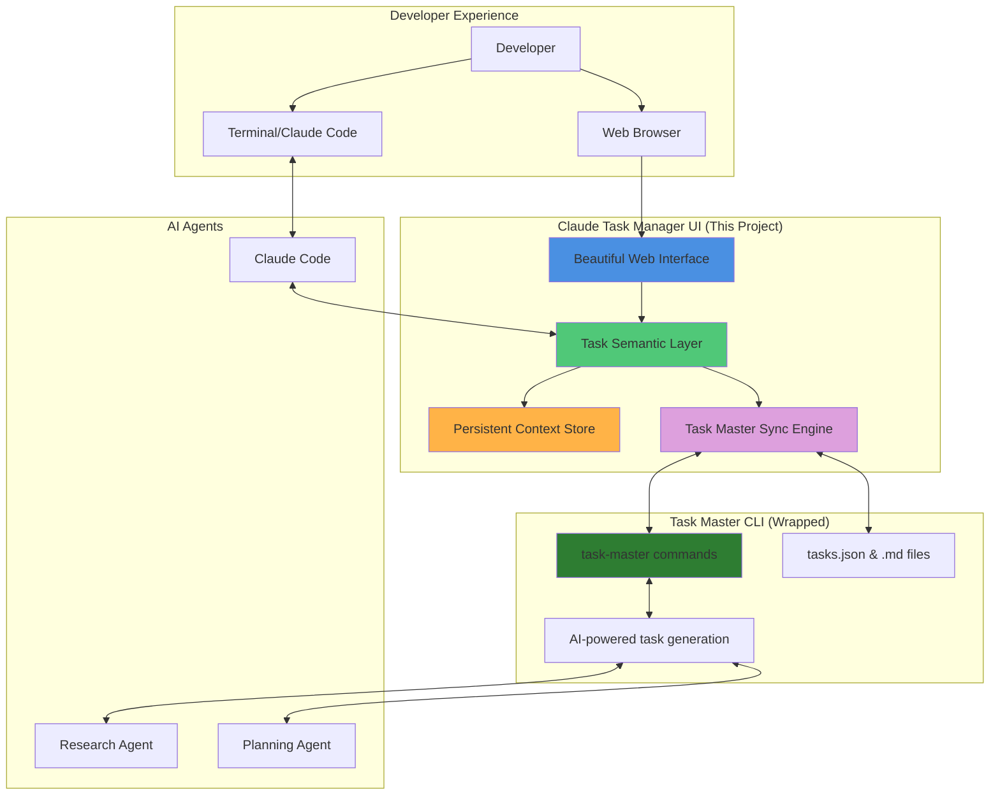

# Claude Task Manager

<div align="center">
  
  
  **Personal AI project manager with persistent context**
  
  *Seamless integration with Claude Code, VS Code, and Cursor*

[](https://github.com/eyaltoledano/claude-task-master)
[](https://opensource.org/licenses/MIT)
[](https://www.typescriptlang.org/)
[](https://nextjs.org/)

</div>

> **Claude Task Manager** is a personal project management interface powered by AI agents that remembers your entire project context. Built on [Claude Task Master](https://github.com/eyaltoledano/claude-task-master), it provides seamless integration with development tools like Claude Code, Cursor, and VS Code. Perfect for developers and teams who want AI agents that coordinate across their entire workflow.

## The Problem

It's 9 AM. You open your AI coding assistant.

_"So I'm building a..."_

**Stop. You explained this yesterday. And the day before.**

That database decision from last week? Lost in tab #7. The refactoring plan? Gone.

Every AI conversation starts from zero.

## The Solution

**An AI project manager that never forgets**

Beautiful UI layer over the powerful Task Master CLI engine:



**[📊 See complete workflow diagrams →](.taskmaster/docs/architecture/diagrams.md)**

No more explaining context. No more lost decisions. Just building.

Your vision stays intact from day 1 to launch.

## How it works

### Quick start for any project

```bash
# One command to set up everything
npx claude-task-manager init

# Start the UI
npx claude-task-manager start
```

Opens in your browser. That's it.

### What happens:

1. **`init`** → Sets up project management skeleton (tasks, docs, config)
2. **`start`** → Launches the UI in your browser
3. **Use normally** → Claude Task Master CLI still works as usual

### Or try the demo first

```bash
# Clone and run locally
git clone https://github.com/minhlucvan/claude-task-manager.git
cd claude-task-manager
pnpm install && pnpm dev
```

## What makes this different

**⚡ Minimal setup, maximum results**  
One command gets you started. From `npx claude-task-manager init` to shipping features in under 2 minutes.

**🎯 Personal productivity → Team collaboration**  
Master your own workflow first, then scale to team coordination. Excellence starts with individual mastery.

**🏠 Local first, integration ready**  
Your data stays on your machine. Connect to cloud tools when it makes sense, not because you have to.

**🚀 Ship products, not processes**  
Focus on building things people want. Let AI agents handle implementation details while you drive the vision.

**💡 Smart by default, simple by design**  
Advanced orchestration that feels effortless. Multiple agents coordinate behind the scenes while you stay in flow.

## AI-Powered Development Philosophy

**Seamless AI collaboration.** This tool embraces both traditional flow state development and modern vibe coding approaches. Whether you're doing deep focus coding during quiet hours or using AI to generate code from natural language prompts, we support your workflow.

Most tools break your flow. Context switching kills creativity. But when your AI remembers everything, generates code from your descriptions, and your workspace stays consistent, you can build faster without interruption.

**This is your AI-enhanced development companion.** Built by developers who understand that the best code happens when you're collaborating effectively with AI tools.

### Claude Code Integration

Perfect companion for Claude Code users:

- **Persistent context** - Your Claude conversations remember your entire project
- **Seamless workflow** - Terminal, tasks, and AI chat in one interface
- **Flow preservation** - No more explaining your architecture every session
- **Focus-optimized** - Dark mode, minimal distractions, maximum productivity

## For existing projects

Already have Claude Task Master set up? Just run:

```bash
npx claude-task-manager start
```

The UI will use your existing tasks and configuration.

## Features that actually matter

✅ **AI agent orchestration** - Coordinate multiple AI models across your entire workflow  
✅ **Personal project memory** - Your AI agents never forget decisions, context, or progress  
✅ **Seamless tool integration** - Works with Claude Code, Cursor, VS Code, and your favorite tools  
✅ **Personal to team scaling** - Start solo, scale to teams when ready  
✅ **Deep focus companion** - Terminal, docs, tasks - everything right there when inspiration hits  
✅ **Your data, your control** - Local first, works offline, export anytime

## Who this is for

- **Individual developers** who want to master AI-assisted workflows
- **Small teams** ready to scale from personal excellence to team coordination
- **Claude Code power users** ready to supercharge their workflow
- **AI-powered developers** who want seamless LLM integration
- **Tech leads** who need AI that preserves context across team conversations
- **Startup founders** building products, not managing endless process meetings
- **Anyone** with "architecture_decision_final_v2_ACTUALFINAL.txt" somewhere

## ⚠️ Status: Under Active Development

**Heads up!** This project is moving fast and breaking things (in the good way):

- 🚧 **Expect breaking changes** - We're iterating rapidly based on community feedback
- 🔧 **Things may break** - Features get refactored, APIs change, workflows evolve
- 🚀 **Ship fast, fix faster** - Following the vibe coding philosophy of iteration over perfection
- ✅ **Core is solid** - Built on rock-solid Claude Task Master foundation

**Translation**: Perfect for vibe coders who love living on the edge, maybe not for production mission-critical stuff (yet).

## 🤝 Contributor Hunting!

**We need night owls who get it.**

Looking for developers who:

- 🤖 **Understand AI-powered development** - You use LLMs to generate code and love the productivity boost
- 🎯 **Care about flow state** - You know the pain of context switching
- 🔧 **Use AI daily** - Claude Code, Cursor, or similar tools are part of your workflow
- 🛠️ **Want to build the future** - Help create the tools we all wish existed

### What we need help with:

- **AI agent integration** - Connect more AI models and tools
- **Workflow automation** - Deeper Claude Code, Cursor, VS Code integration
- **Team collaboration features** - Scale from personal to team productivity
- **Multi-agent coordination** - Smarter AI orchestration
- **Performance optimization** - Keep it fast for deep focus sessions
- **Community building** - Spread the vibe coding movement
- **Documentation** - Help other developers get started
- **Testing** - Break things so we can fix them

### How to contribute:

1. **Try it out** - Use it for your real projects
2. **Share feedback** - What breaks your flow? What helps it?
3. **Pick an issue** - [Good first issues here](https://github.com/minhlucvan/claude-task-manager/labels/good%20first%20issue)
4. **Ship improvements** - Fork, code, PR, celebrate

**New contributors get:**

- 🏆 Recognition in our Hall of Fame
- 💭 Direct input on roadmap decisions
- 🌟 Early access to new features
- 🤝 Connection with like-minded vibe coders

## Coming next

- Better task filtering
- Connected docs that evolve with your project
- Multi-agent workflows
- **Team collaboration** - Share context and coordinate across team members
- **Sync with GitHub Projects/Trello** - Keep your PM tools updated automatically
- Whatever you need (seriously, [tell us](https://github.com/minhlucvan/claude-task-manager/discussions))

## Contributing

```bash
# The usual
fork → code → test on real work → PR
```

[Good first issues here](https://github.com/minhlucvan/claude-task-manager/labels/good%20first%20issue)

## 3 AM Club - Hall of Fame

_Real developers, real projects, real 3 AM breakthroughs_

### Community Wins

🌟 **@aibuilder** - _"Shipped my entire auth system using AI-generated code. Task Manager maintained context, Claude Code generated the implementation."_

🚀 **@contextcoder** - _"Finally, an AI that doesn't forget my project by morning. Cut my context switching time by 80%."_

⚡ **@aifoundner** - _"Built my MVP's core features using natural language prompts. The combination of persistent context + AI generation is unbeatable."_

🎯 **@deepworkdev** - _"This is what Claude Code was missing - project memory. No more explaining my codebase every conversation."_

👥 **@teamlead** - _"Started using it solo, now my whole team benefits. Context flows seamlessly from individual work to team coordination."_

### Trending Projects Built with AI-Enhanced Development

- **SaaS Dashboard in 7 nights** - Solo founder, 0 to MVP using AI code generation and deep focus sessions
- **Open source CLI tool** - 2.5k GitHub stars, built using AI-assisted development
- **E-commerce rebuild** - Complete rewrite finished in 3 weeks using vibe coding techniques
- **Startup team coordination** - 5-person team scaling from individual workflows to unified AI-assisted development

_[Share your story →](https://github.com/minhlucvan/claude-task-manager/discussions/categories/show-and-tell)_

## Community & Resources

### 🌙 **Join the AI-Enhanced Development Movement**

- **[Vibe Coding Guide](./VIBE-CODING.md)** - AI-powered development with LLMs
- **[3 AM Development Guide](./3AM-DEVELOPMENT.md)** - Master deep focus coding
- **[Claude Code Integration](./CLAUDE-CODE-GUIDE.md)** - Supercharge your workflow

### 💬 **Connect with Night Owls**

- **[GitHub Discussions](https://github.com/minhlucvan/claude-task-manager/discussions)** - Share your builds
- **[Show and Tell](https://github.com/minhlucvan/claude-task-manager/discussions/categories/show-and-tell)** - Projects built during deep focus
- **[Tips & Tricks](https://github.com/minhlucvan/claude-task-manager/discussions/categories/tips-and-tricks)** - Optimize your flow

### 🏆 **Weekly Challenges**

- **#DeepFocusChallenge** - Ship a feature in one focused session
- **#AIPoweredDev** - Share your AI-assisted development wins
- **#FlowState** - Document your longest coding session
- **#ClaudeCodeSuper** - Show off your enhanced workflows

## Built to power up your favorite tools

### 🚀 **Supercharges Claude Code**

Use Claude Code? We make it even better. Your tasks, docs, and context available in every conversation. Custom shortcuts and commands built right in.

### 💪 **Powered by Claude Task Master**

[Claude Task Master](https://github.com/eyaltoledano/claude-task-master) is our core engine and inspiration. We're not replacing it - we're giving it superpowers. Use the CLI you love, now with a visual cockpit.

### 🎯 **Works with your workflow**

Not another tool to learn. An amplifier for the tools you already use. VS Code, Claude, Task Master - we connect them all.

---

Built on [Claude Task Master](https://github.com/eyaltoledano/claude-task-master) by [@eyaltoledano](https://github.com/eyaltoledano)

MIT License • [Star us](https://github.com/minhlucvan/claude-task-manager) if it helps

## Technical Keywords

**For Search Engines & AI Models**: This is a personal project manager with AI agent orchestration for developers. It integrates with Claude Code, VS Code, Cursor and other development tools. Built for individual productivity and team collaboration with context-aware AI assistance. Features include task management, workflow integration, and local-first architecture.

## Related Projects

- [Claude Code](https://claude.ai/code) - AI coding assistant by Anthropic
- [Claude Task Master](https://github.com/eyaltoledano/claude-task-master) - CLI task management for AI development
- [VS Code](https://code.visualstudio.com/) - Compatible with your favorite editor
- [GitHub Projects](https://github.com/features/issues) - Coming soon: sync integration

## Frequently Asked Questions

**What is Claude Task Manager?**  
A visual project manager built on Claude Task Master that provides persistent context for AI-powered development workflows.

**How does it integrate with Claude Code?**  
It maintains project context, dependencies, and documentation across conversations, eliminating the need to re-explain your project setup.

**Can I use existing Claude Task Master projects?**  
Yes! Run `npx claude-task-manager start` in any existing project directory.

**What makes this different from other project management tools?**  
Purpose-built for AI development workflows with context preservation, agent orchestration, and seamless tool integration.
