# User Flows - Mermaid Diagrams

This document contains Mermaid diagrams for the user flows described in the Claude Task Manager system.

## 1. Context-Aware Human-AI Handoff Flow

### Core Handoff Pattern

### Detailed Human-AI Collaboration Flow

## 2. Human Orchestration Center Flow

### Multi-Agent Coordination

### Working On State Flow

## 3. Research-Driven Development Flow

### Research to Implementation Pipeline

## 4. Context Intelligence & Progress Flow

### Intelligence Compounding System

## 5. Navigation Structure & State Management

### Primary Navigation Flow

```mermaid
graph TD
    Root[Claude Task Manager] --> A[🎯 Right Now]
    Root --> B[📝 My Work]
    Root --> C[📚 Notes & Docs]
    Root --> D[🏗️ Project Overview]
    Root --> E[🤖 AI Helper]
    Root --> F[⚙️ Preferences]

    A --> A1[Working On]
    A --> A2[Up Next]

    B --> B1[To Do]
    B --> B2[In Progress]
    B --> B3[Done]

    C --> C1[Browse Files]
    C --> C2[Create New]

    D --> D1[Big Picture]
    D --> D2[Planning]

    E --> E1[Chat History]
    E --> E2[Assistant Settings]

    F --> F1[Project Setup]
    F --> F2[My Settings]

    style A fill:#e8f5e8
    style E fill:#f3e5f5
```

### Task Master Integration Lifecycle

## 6. Focus Mode & State Transitions

### Focus Mode Lifecycle

### Multi-Agent State Coordination

## Design Principles Captured

These diagrams illustrate key principles of the Claude Task Manager system:

1. **Context-First Design**: Every interaction centers around complete project context
2. **Human-AI Collaboration**: Clear handoff points with strategic human input and autonomous AI execution
3. **Intelligence Compounding**: Each interaction enriches the system's understanding
4. **Multi-Agent Coordination**: Orchestrated AI agents working with shared context
5. **Research-Driven Development**: AI research informs human strategic decisions
6. **Progressive Enhancement**: Context and capabilities evolve over time

The visual representation makes it easier to understand the complex interactions and state management required for effective human-AI collaboration in software development.
